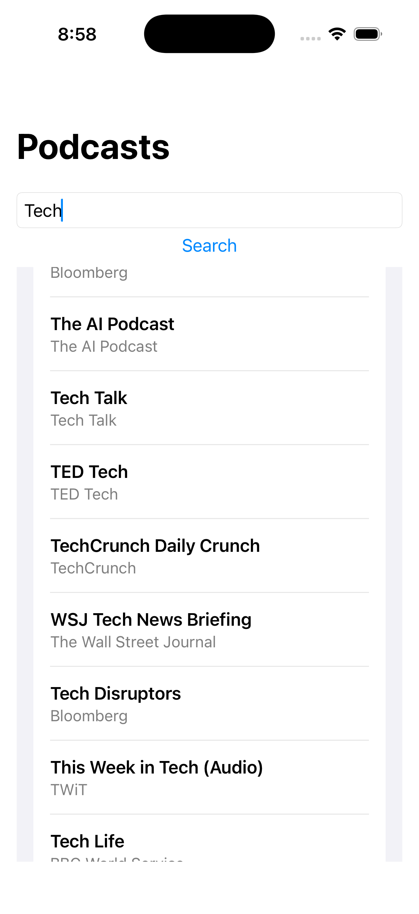

# CleanPodcast

A sample iOS application that allows users to search podcasts using the **iTunes Search API**.

The project's primary goal is not the podcast functionality itself, but to demonstrate the implementation of **Clean Architecture** in a modern iOS application using SwiftUI, Swift Concurrency, Dependency Injection, and unit testing.

<p align="center">
  
</p>

---

---

# Architecture

The application follows **Clean Architecture**, where dependencies always point inward toward the business rules.

```
Presentation
      │
      ▼
Domain
      │
      ▼
Data

──────────────

Core (Shared Infrastructure)
```

---

## Presentation

The Presentation layer is responsible for translating user interactions into application behavior and exposing state to the UI.

It orchestrates application flows by invoking Use Cases but contains no business rules or knowledge of data retrieval.

### Responsibilities

- Render the user interface
- Manage presentation state
- Handle user interactions
- Coordinate application flows
- Display success and error states

### Components

- SwiftUI Views
- ViewModels
- State
- Actions

---

## Domain

The Domain layer contains the business rules of the application.

It defines the contracts that drive the architecture and remains completely independent from frameworks, networking, persistence, or presentation.


### Responsibilities

- Model business entities
- Define application use cases
- Declare repository contracts
- Remain independent from implementation details

### Components

- Domain Models
- Repository Protocols
- Use Cases

---

## Data

The Data layer fulfills the contracts defined by the Domain layer.

It is responsible for obtaining data from external sources, transforming infrastructure models into Domain Models, and hiding all implementation details from the business layer.

The Domain never knows whether the data comes from a REST API, local storage, or any other source.

### Responsibilities

- Implement repository contracts
- Retrieve data from external sources
- Transform DTOs into Domain Models
- Isolate infrastructure concerns
- Abstract data source implementations

### Components

- Repository Implementations
- Remote Data Sources
- DTOs
- Mappers

---

# Core

Core contains shared infrastructure that supports the application but does not belong to the Clean Architecture layers.

### Responsibilities

- Provide networking infrastructure
- Centralize dependency creation
- Share reusable components

### Components

- NetworkClient
- HTTPMethod
- DependencyContainer

---

# Dependency Flow

Communication always follows a single direction.

```
View
      │
      ▼
ViewModel
      │
      ▼
UseCase
      │
      ▼
Repository (Protocol)
      │
      ▼
Repository Implementation
      │
      ▼
Remote Data Source
      │
      ▼
NetworkClient (Core)
```

---

# Architectural Decisions

| Decision | Purpose |
|----------|---------|
| Clean Architecture | Separate business rules from infrastructure concerns |
| MVVM | Isolate presentation logic from SwiftUI Views |
| Repository Pattern | Decouple business logic from data sources |
| Dependency Injection | Reduce coupling and improve testability |
| Data Mapper | Prevent infrastructure models from leaking into the Domain |
| Protocol-Oriented Design | Enable dependency inversion and mocking |

---

# Testing

Each architectural layer is independently tested to verify its responsibilities in isolation.

### Covered Components

- Use Cases
- Repository Implementations
- Data Mappers
- ViewModels

